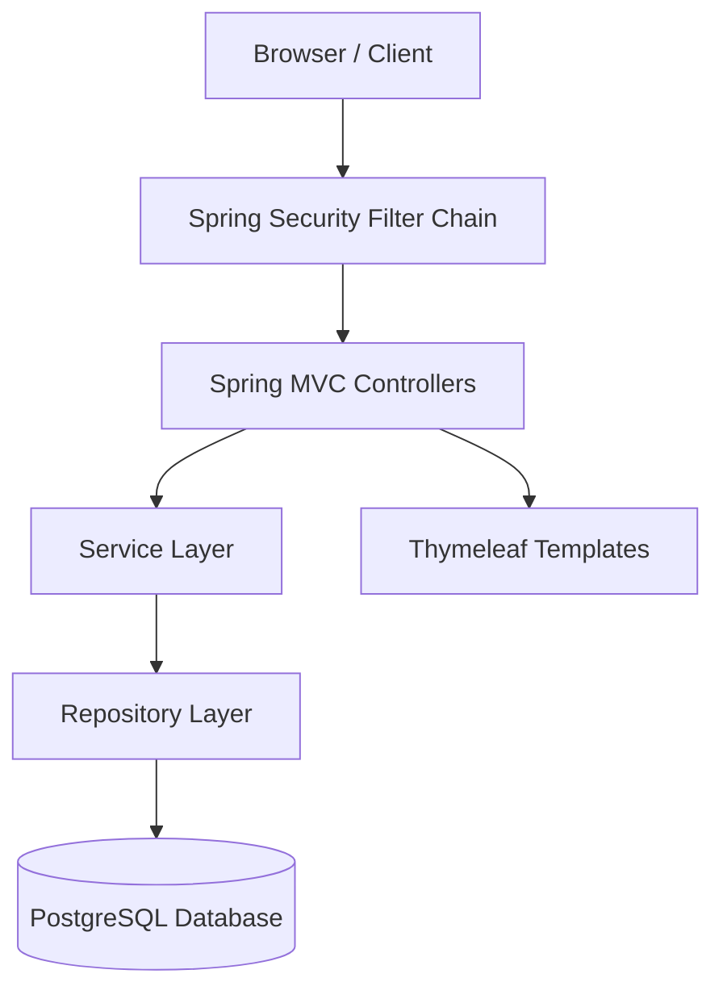
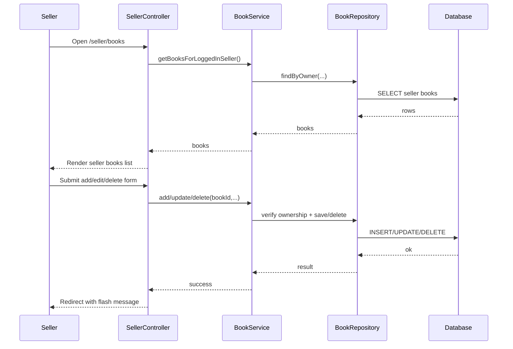
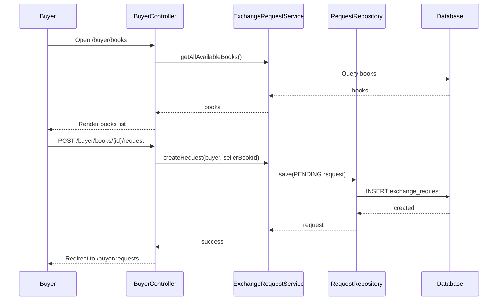
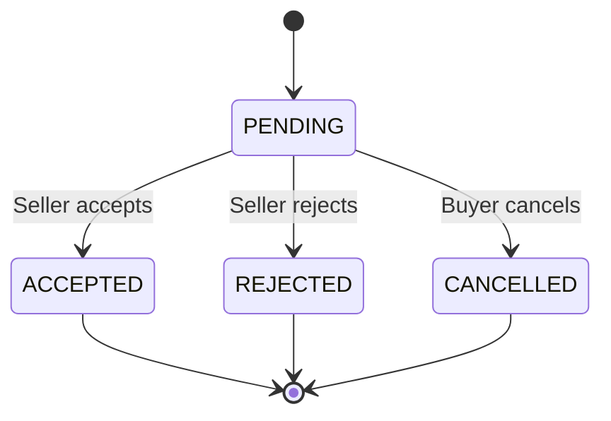
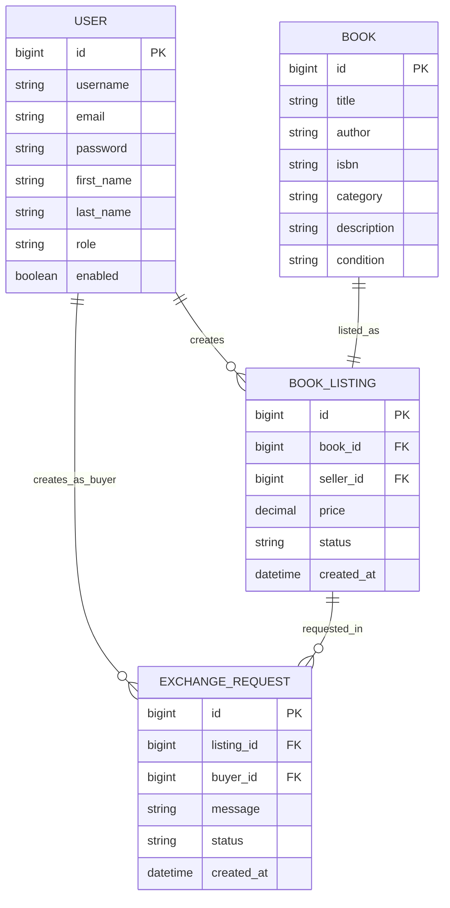
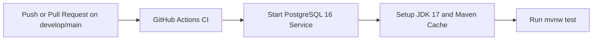

# BookExchange

[](https://www.java.com/)
[](https://spring.io/projects/spring-boot)
[](https://maven.apache.org/)
[](https://www.thymeleaf.org/)
[](https://www.docker.com/)

A Spring Boot web application for book exchange workflows with role-based pages for **Seller**, **Buyer**, and **Admin**.

## Live Demo

Access the deployed app: https://bookexchange-2.onrender.com

---

## Table of Contents

- [Project Description](#project-description)
- [Architecture](#architecture)
- [ER Diagram](#er-diagram)
- [Features](#features)
- [API Endpoints](#api-endpoints)
- [Tech Stack](#tech-stack)
- [Run Instructions](#run-instructions)
- [CI/CD Explanation](#cicd-explanation)
- [Pipeline](#pipeline)
- [Branch Strategy](#branch-strategy)
- [Project Structure](#project-structure)
- [Notes](#notes)

---

## Project Description

BookExchange is a role-based application focused on exchanging books:

- **Sellers** can add, edit, delete, and manage their own book listings.
- **Buyers** can browse all available listings, send exchange requests, track request status, and cancel their own pending requests.
- **Admins** can manage users, monitor listings, and review requests.

Core goals:

- Clear Spring MVC + service + repository architecture
- Server-rendered pages with Thymeleaf
- Persistent storage with Spring Data JPA and PostgreSQL

---

## Architecture

The project follows a layered Spring Boot architecture:

1. **View Layer** - Thymeleaf templates render buyer/seller/admin pages.
2. **Controller Layer** - Handles HTTP requests and model preparation.
3. **Service Layer** - Implements ownership checks and request status transitions.
4. **Repository Layer** - Performs database operations via Spring Data JPA.
5. **Model Layer** - JPA entities and enums define domain state.

Architecture diagram:



Detailed diagrams and notes are included below in this README.

### Seller Book CRUD Flow

Important rule: a seller can only manage books they own.



### Buyer Exchange Request Flow



### Seller Request Decision Flow



---

## ER Diagram

Current JPA model contains **4 entities (4 tables)**:

- `USER` (`users`)
- `BOOK` (`books`)
- `BOOK_LISTING` (`book_listings`)
- `EXCHANGE_REQUEST` (`exchange_requests`)



> Note: exact column naming in DB can vary by JPA naming strategy.

---

## Features

- Form-based registration and login (`/auth/*`)
- Seller CRUD for own listings only
- Buyer browsing across all available listings
- Buyer exchange request creation and cancellation
- Seller request accept/reject flow
- Admin pages for users, listings, and requests
- MVC templates plus REST endpoints under `/api/*`

---

## API Endpoints

This project includes both **MVC endpoints** (Thymeleaf pages/forms) and **REST endpoints** (`/api/*`).

### Auth / Common (MVC)

| Method | Path | Auth | Description |
| ------ | ---- | ---- | ----------- |
| GET | `/` | Public | Landing page |
| GET | `/auth/login` | Public | Login page |
| POST | `/auth/login` | Public | Login processing (Spring Security) |
| GET | `/auth/register` | Public | Registration page |
| POST | `/auth/register` | Public | Register new user |
| GET | `/dashboard` | Required | Role-based dashboard redirect |
| POST | `/auth/logout` | Required | Logout |

### Seller (MVC)

| Method | Path | Auth | Description |
| ------ | ---- | ---- | ----------- |
| GET | `/dashboard/seller` | SELLER | Seller dashboard |
| GET | `/seller/books` | SELLER | Seller listing list |
| GET | `/seller/books/add` | SELLER | Add listing form |
| POST | `/seller/books/add` | SELLER | Create listing |
| GET | `/seller/books/edit/{id}` | SELLER | Edit form |
| POST | `/seller/books/edit/{id}` | SELLER | Update listing |
| GET | `/seller/books/delete/{id}` | SELLER | Delete confirm page |
| POST | `/seller/books/delete/{id}` | SELLER | Delete listing |
| GET | `/seller/requests` | SELLER | Incoming requests |
| GET | `/seller/requests/{id}` | SELLER | Request details |
| GET | `/seller/requests/{id}/confirm-accept` | SELLER | Accept confirm page |
| POST | `/seller/requests/{id}/accept` | SELLER | Accept request |
| GET | `/seller/requests/{id}/confirm-reject` | SELLER | Reject confirm page |
| POST | `/seller/requests/{id}/reject` | SELLER | Reject request |

### Buyer (MVC)

| Method | Path | Auth | Description |
| ------ | ---- | ---- | ----------- |
| GET | `/dashboard/buyer` | BUYER | Buyer dashboard |
| GET | `/buyer/books` | BUYER | Browse all available listings |
| GET | `/buyer/books/{id}` | BUYER | Listing details |
| POST | `/buyer/books/{id}/request` | BUYER | Send request |
| GET | `/buyer/requests` | BUYER | Buyer request list |
| GET | `/buyer/requests/{id}` | BUYER | Request details |
| GET | `/buyer/requests/{id}/confirm-cancel` | BUYER | Cancel confirm page |
| POST | `/buyer/requests/{id}/cancel` | BUYER | Cancel request |

### Admin (MVC)

| Method | Path | Auth | Description |
| ------ | ---- | ---- | ----------- |
| GET | `/dashboard/admin` | ADMIN | Admin dashboard |
| GET | `/admin/users` | ADMIN | User management list |
| POST | `/admin/users/{id}/enabled` | ADMIN | Enable/disable user |
| GET | `/admin/books` | ADMIN | Listing management list |
| POST | `/admin/books/{id}/status` | ADMIN | Update listing status |
| GET | `/admin/requests` | ADMIN | Request oversight list |

### REST Endpoints

### Auth

| Method | Endpoint | Description |
|---|---|---|
| POST | `/api/auth/register` | Register a user |
| POST | `/api/auth/login` | Login and authenticate |

### Listings

| Method | Endpoint | Description |
|---|---|---|
| GET | `/api/listings` | Get all available listings |
| GET | `/api/listings/seller` | Get listings of current seller |
| GET | `/api/listings/{id}` | Get one listing |
| POST | `/api/listings` | Create listing (seller) |
| PUT | `/api/listings/{id}` | Update listing (owner seller) |
| DELETE | `/api/listings/{id}` | Delete listing (owner seller) |

### Exchange Requests

| Method | Endpoint | Description |
|---|---|---|
| GET | `/api/requests/buyer` | Buyer request history |
| GET | `/api/requests/seller` | Requests on seller books |
| GET | `/api/requests/{id}` | Request detail |
| POST | `/api/requests` | Create exchange request |
| POST | `/api/requests/{id}/cancel` | Buyer cancels request |
| POST | `/api/requests/{id}/accept` | Seller accepts request |
| POST | `/api/requests/{id}/reject` | Seller rejects request |

---

## Tech Stack

| Layer | Technology |
| ----- | ---------- |
| Language | Java 17 |
| Framework | Spring Boot 4.0.3 |
| Web | Spring MVC + Thymeleaf |
| Security | Spring Security + Thymeleaf Security Extras |
| Validation | Jakarta Bean Validation (`spring-boot-starter-validation`) |
| Persistence | Spring Data JPA / Hibernate |
| Database | PostgreSQL |
| Build Tool | Maven Wrapper (`mvnw`, `mvnw.cmd`) |
| Boilerplate Reduction | Lombok |
| Developer Tooling | Spring Boot DevTools |
| Testing | JUnit 5, Spring Boot Test, Mockito (via starter), Spring Security Test |
| Containerization | Docker + Docker Compose |
| Compose Integration | `spring-boot-docker-compose` dependency (auto-management disabled in properties) |

---

## Test Inventory

Current test coverage in this repository:

- **Unit test classes:** 3 (`AuthServiceTest`, `BookServiceTest`, `ExchangeRequestServiceTest`)
- **Unit test methods:** 38
- **Integration test classes:** 5 (`BookexchangeApplicationTests`, `AuthControllerIntegrationTest`, `DashboardControllerIntegrationTest`, `SecurityIntegrationTest`, `UserRepositoryIntegrationTest`)
- **Integration test methods:** 26

> Counts are based on current files under `src/test/java` and `@Test` annotations.

---

## Run Instructions

(Docker-based)

1. Clone the Repository

```bash
git clone https://github.com/RajorshiDas/Bookexchange.git
cd bookexchange
```

2. Build the Docker Image

```bash
docker build -t bookexchange .
```

3. Run PostgreSQL + App together with Docker Compose (recommended)

```bash
docker compose up --build
```

The application will start at: http://localhost:8080

4. Stop services

```bash
docker compose down
```

If you run only the app image (`docker run`), you must also provide datasource variables and a reachable PostgreSQL instance:

```bash
docker run -p 8080:8080 \
  -e SPRING_DATASOURCE_URL=jdbc:postgresql://<db-host>:5432/bookexchangedb \
  -e SPRING_DATASOURCE_USERNAME=postgres \
  -e SPRING_DATASOURCE_PASSWORD=123456 \
  bookexchange
```

---

## Render Deployment

### Prerequisites

- GitHub repository with the BookExchange code
- Render account (https://render.com)
- PostgreSQL database ready (Render managed or external)

### Steps

1. **Connect Your Repository to Render**
   - Go to Render dashboard -> New + -> Web Service
   - Connect your GitHub repository
   - Select the branch to deploy (for example, `main`)

2. **Configure Web Service**
   - **Name**: `bookexchange`
   - **Environment**: Docker
   - **Dockerfile**: `Dockerfile`
   - **Build Command**: leave empty (Dockerfile builds app)
   - **Start Command**: leave empty (Dockerfile entrypoint starts app)

3. **Add PostgreSQL Database**
   - Create a PostgreSQL service in Render
   - Note connection details (host, port, user, password)

4. **Set Environment Variables**
   - `SPRING_DATASOURCE_URL`
   - `SPRING_DATASOURCE_USERNAME`
   - `SPRING_DATASOURCE_PASSWORD`
   - `PORT` (optional, Render usually provides this)

5. **Deploy and Verify**
   - Trigger deploy
   - Open app URL (`https://bookexchange-2.onrender.com`)
   - Verify login and dashboard pages

---

## CI/CD Explanation

This project uses a GitHub Actions workflow: `.github/workflows/ci.yml`.

### Trigger Rules

- Runs on `push` to `develop` and `main`
- Runs on `pull_request` targeting `develop` and `main`

### CI Job Details

- **Runner**: `ubuntu-latest`
- **Service**: PostgreSQL 16 container with health checks
- **Database config (env)**:
  - `SPRING_DATASOURCE_URL=jdbc:postgresql://localhost:5432/bookexchangedb`
  - `SPRING_DATASOURCE_USERNAME=postgres`
  - `SPRING_DATASOURCE_PASSWORD=postgres`
  - `SERVER_PORT=8080`

### CI Steps

1. Checkout repository (`actions/checkout@v4`)
2. Set up JDK 17 (`actions/setup-java@v4`, Temurin, Maven cache)
3. Make Maven wrapper executable (`chmod +x mvnw`)
4. Run tests (`./mvnw test`)

---

## Pipeline



---

## Branch Strategy

Suggested simple strategy:

- `main` -> stable branch
- `feature/*` -> new features
- `bugfix/*` -> bug fixes
- pull request review before merge to `main`

---

## Project Structure

- `src/main/java` - controllers, services, entities, repositories, configuration
- `src/main/resources/templates` - Thymeleaf templates
- `src/main/resources/application.properties` - runtime configuration
- `src/test` - test sources
- `src/test/resources/application-test.properties` - test configuration
- `.github/workflows/ci.yml` - GitHub Actions CI workflow
- `Dockerfile` - image build instructions
- `compose.yaml` - local app + PostgreSQL setup

---

## Notes

- Database credentials are currently managed via environment variables in `src/main/resources/application.properties`.
- CSRF is disabled in current security config, so templates should not depend on `_csrf` model attributes.
- Mermaid diagrams render on GitHub after push when code fences and syntax are valid.
